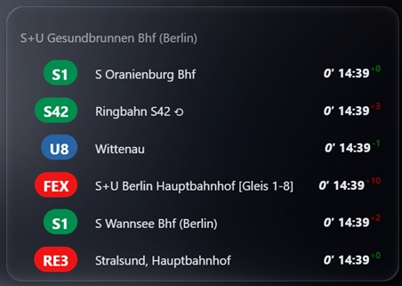
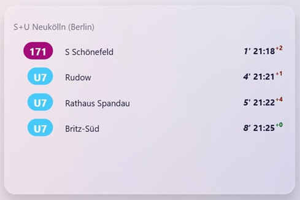
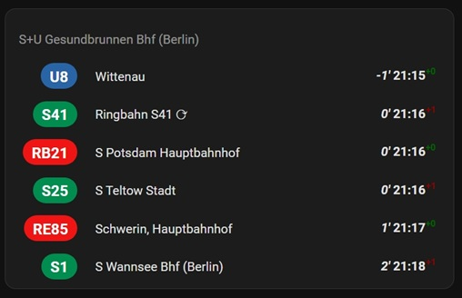

# 🚉 Berlin (BVG) & Brandenburg (VBB) Public Transport Departures for Home Assistant

> ℹ️ [Hier klicken](https://github.com/manoth-msft/home-assistant-bvg-vbb-departures/blob/main/docs/liesmich.md) für eine deutsche Beschreibung.

This integration brings **live public transport data** from Berlin and Brandenburg directly into your Home Assistant dashboard. It uses the official VBB API to fetch real-time departures from BVG and VBB stops — including line numbers, destinations, departure times, and delays.

Whether you're commuting, picking up your kids, or just wondering when the next Ringbahn arrives, this integration shows upcoming departures from your selected stops in a clean, readable format.

> 🛠️ This project is a fork of the original Berlin Transport integration by [vas3k](https://github.com/vas3k/home-assistant-berlin-transport) — with enhanced filtering, customization options, and independent maintenance.



## ✨ Features
- **Real-time departures** from BVG & VBB stops, including line numbers, destinations, delays, and platforms, updated every 90 seconds  
- **Dashboard card integration** for a clean, user-friendly display of upcoming departures
- **Advanced filtering options**: direction, excluded stops, transport types (bus, tram, ferry, etc.)  
- **Customization**: walking time offset, duration window, official VBB line colors, Ringbahn ⟳/⟲ toggle  
- **Localization support** with German and English translations

## 💿 Installation

This integration consists of two components:  
1. **Integration** – fetches real-time departure data from BVG/VBB  
1. **Dashboard card** – displays the data in a clean, user-friendly format  

You need both components. The recommended way to install is via [HACS](https://hacs.xyz/) for easy updates and seamless integration. The setup takes less than 10 minutes.

If you prefer manual installation, please see the [manual installation guide](https://github.com/manoth-msft/home-assistant-bvg-vbb-departures/blob/main/docs/manual_install.md).

### 1️⃣ Add repositories to HACS

Open Home Assistant and go to **HACS → Three dots in top right corner → Custom repositories**. Add both of the following repositories:

- `https://github.com/manoth-msft/home-assistant-bvg-vbb-departures` → Type: **Integration**  
- `https://github.comv/manoth-msft/home-assistant-dashboard-card-bvg-vbb-departures` → Type: **Dashboard**

Click **Add**, then reload the HACS page (hit `F5`) to make sure both repositories are available.

### 2️⃣ Search and install components via HACS

1. After refreshing the HACS page, use the search bar and type **bvg**.  
1. We need the following components:
   - **BVG/VBB real-time departures** (Integration)  
   - **Card for BVG/VBB real-time departures integration** (dashboard)
1. Open each entry and select **Download** from the lower‑right corner.
1. Wait for the download to finish. Then refresh the page and restart Home Assistant to activate both components.

### 3️⃣ Add and configure integration

1. Under `Settings → Devices & services`, select **Add Integration**, search for **bvg**, and choose **BVG/VBB Departures**.  
1. Enter the name of the stop you want to monitor. Partial names are supported. Click **OK**, then pick your station from the list of matches and confirm with **OK**.  
1. (Optional) Configure additional parameters such as direction filters, excluded stops, walking time, Ringbahn options, and more.  
   → See [Additional configuration details](#integration
) for a full overview.  
1. Finally, click **OK** and **Done**. The entity will be created and receive its first update within 1–2 minutes.

### 4️⃣ Add card to dashboard

1. Open the dashboard of your choice and add a new card.  
1. Under **Custom cards**, select the **BVG/VBB departures card**.  
1. Choose the entity you just created and adjust the configuration if needed.  
   → Configuration options are described [here](#card).  
1. Save the card. Within a few minutes it will update and display the real‑time BVG/VBB departures.  

Done 🎉

## ⚙️ Additional configuration details
### 🔧 Integration

- **Direction**: Use `stop_id` to filter departures by direction. Provide the `stop_id` of a stop along the intended line or its final destination. Multiple values can be specified using a comma‑separated list. See [below](#how-do-i-find-my-stop_id) for how to find the `stop_id`.  
- **Exclude stops**: List of `stop_id` values to exclude nearby stops. Multiple values can be specified using a comma‑separated list.  
- **Duration**: Defines how many minutes into the future departures are fetched (default: 10).  
- **Walking time**: Enter the time needed to walk to the stop. This prevents unreachable departures from being shown.  
- **Enable official VBB line colors**: Optionally enable official VBB line colors. By default, predefined colors are used.  
- **Hide Ringbahn ⟳/⟲**: Optionally hide clockwise or counter‑clockwise Ringbahn services.  
- **Remove (Berlin) suffix**: Automatically strip the "(Berlin)" suffix from station names.  
- **Transport options**: Choose which transport types (e.g., bus, ferry) to show or hide.


#### 📝 Example configuration

Suppose you want to monitor S‑Bahn departures from **S Treptower Park**.  
You only want to see trains heading to **S+U Neukölln**, exclude departures from the nearby bus stop, and capture the next 30 minutes.  
Since you need about 10 minutes to reach the station, unreachable departures should be hidden.  
You also prefer not to see the Ringbahn ⟲ (which technically also goes to S+U Neukölln) and like the clean look without the **(Berlin)** suffix appended to station names.

Then your additional configuration would look like this:

- **Direction**: `900078201` (S+U Neukölln)  
- **Excluded stops**: `900190702` (bus stop at S Treptower Park)  
- **Duration**: `30` minutes  
- **Walking time**: `10` minutes  
- **Hide Ringbahn ⟲**: enabled  
- **Remove (Berlin) suffix**: enabled  
- **Transport options**: all disabled except **Suburban**

### 🗂️ Card

- **Show cancelled departures**: Decide whether cancelled departures should be displayed.  
  If enabled, they appear struck through in the list; otherwise, they are hidden.  

- **Show delay**: Choose whether reported delays are shown.  
  If enabled, the delay is displayed next to the departure time.  

- **Show absolute time of departures**: Display the exact scheduled departure time.  

- **Show relative time of departures**: Display the countdown (e.g., “in 5 minutes”) until departure.  

- **Subtract walking time from relative time of departures**: Subtract your walking time to the stop from the relative countdown.  
  For example, if the bus leaves in 15 minutes and you configured 10 minutes walking time, enabling this option will show that you need to leave the house in 5 minutes to catch the bus.

## ❓ FAQ
### Q: How do I find my stop_id?

The primary stop you select will be resolved automatically by the integration.  
You only need to look up `stop_id` values if you want to use advanced configuration options such as **Direction** or **Excluded stops**.

To find a `stop_id`, you can query the VBB API. Open the link below in a new window and replace `alexanderplatz` with the name of your stop. Partial matches are supported.

**https://v6.vbb.transport.rest/locations?results=1&query=alexanderplatz**

The API will return a response similar to:

```json
[
  {
    "type": "stop",
    "id": "900100003",
    "name": "S+U Alexanderplatz Bhf (Berlin)",
    "location": {
      "type": "location",
      "id": "900100003",
      "latitude": 52.521508,
      "longitude": 13.411267
    },
    "products": {
      "suburban": true,
      "subway": true,
      "tram": true,
      "bus": true,
      "ferry": false,
      "express": false,
      "regional": true
    },
    "stationDHID": "de:11000:900100003"
  }
]
```
The first `"id"` field contains the required `stop_id` — here: **900100003**.

---

### Q: What data source does this sensor use?
A: The sensor uses the VBB Public API to fetch all transport information.  
- API docs: [https://v6.vbb.transport.rest/api.html](https://v6.vbb.transport.rest/api.html)  
- Rate limit: 100 requests per minute  
- Data format: [HAFAS](https://github.com/public-transport/hafas-client)

---

### Q: How often does the component update?
A: The component updates every 90 seconds. It makes a separate request for each stop. This is usually sufficient, but adding dozens of stops is not recommended to avoid hitting the rate limit.

---

### Q: What happens if the VBB API returns errors?
A: The API may occasionally return 503 or timeout errors due to temporary instability. These do not affect the integration’s functionality beyond generating warning messages in the Home Assistant logs. Currently, there is no reliable workaround for this behavior.

---

### Q: What entities are created by the integration?
A: For each stop, the integration creates one entity. It stores the upcoming departures in `attributes.departures`. The entity state itself is mainly for human-readable display of the next departure.

---

### Q: How can I change configuration options later?
A: Go to **Settings > Devices & Services**, select the **BVG/VBB Departures** integration, and click on the three dots next to the entity you want to update. Delete the entry.  
Then choose **Add service** and re‑add the stop with the adjusted configuration.  
The new entity will receive the same ID as the previous one, so your dashboards do not need to be updated.

### Q: Can I use the integration outside of Berlin and Brandenburg?
A: The integration is based on the standardized HAFAS format, which is used in many other cities as well. This means you should be able to adapt the component to other locations if desired.

## 🤝 Contributions, Bugs & Feature Requests

This project is a small side project, so while I cannot guarantee full support or help with dashboard configuration, I truly appreciate your understanding — and even more your contributions!

- **Contributions**: Pull requests are always welcome. Feel free to [open a PR](https://github.com/manoth-msft/home-assistant-bvg-vbb-departures/pulls) for review.
  If you’re unsure about an idea, simply [open an issue](https://github.com/manoth-msft/home-assistant-bvg-vbb-departures/issues) and ask for advice.

- **Bug reports**: If you discover a bug, please [open an issue](https://github.com/manoth-msft/home-assistant-bvg-vbb-departures/issues) and describe the exact steps to reproduce it. Screenshots, logs, and details are very helpful to track down the problem.

- **Feature requests**: Missing a feature? Share your idea in issues — or feel free to try coding it yourself and submit a PR.

## 👮‍♀️ License

- [MIT](./LICENSE.md)